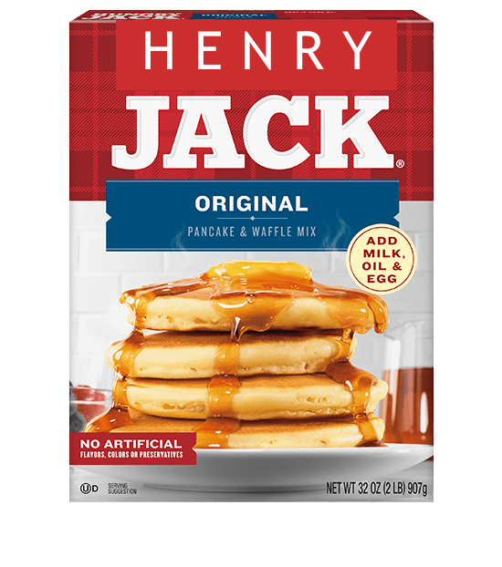

# Henry Jack

Check the weather while you eat your breakfast.

There's a single `/` endpoint.
Use query parameters `lat` and `lon` to choose your location.
For example `?lat=45&lon=-93` for Blaine, MN.
(Negative latitude is south; negative longitude is west.)

All responses are json. Successful responses have a `weather` key
and possible array of alerts (`null` otherwise)
e.g. `{ "weather": "hot and tornadoes", alerts: ["take cover!"] }`.
Unsuccessful responses will include an `error`;
e.g. `{ "error": "something went wrong" }`.

## Development

    cp example.env .env
    chmod 600 .env
    # edit .env

    npm install
    npm run build
    npm run dev

## Production

    npm run build
    npm start

## TODO

- add more tests
- docker
- deploy on server
- use [concurrently](https://www.npmjs.com/package/concurrently)
  or a bash script to wrap the bg dev watch processes
